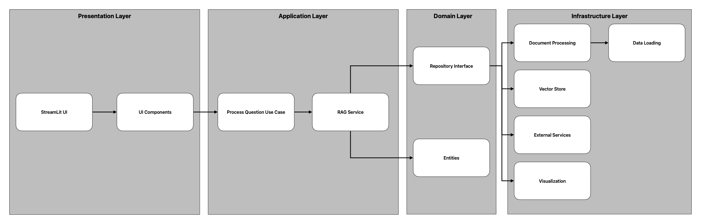
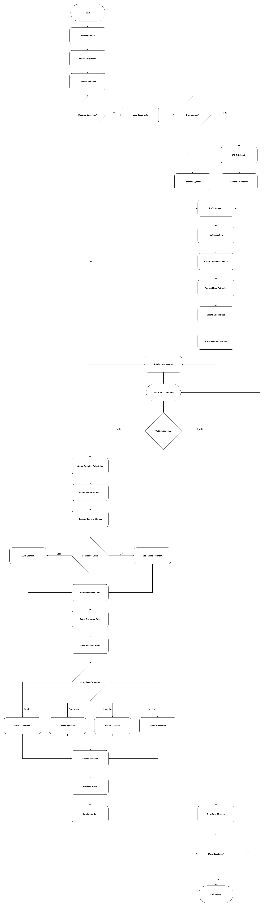

# RAG-Based Financial Report Analyzer

A sophisticated web application that allows users to ask questions about Bank Central Asia's financial reports and get intelligent answers with source citations and visualizations using Retrieval-Augmented Generation (RAG).

## 🚀 Features

- **Natural Language Queries**: Ask questions about financial data in plain language
- **AI-Powered Answers**: Get responses powered by OpenAI GPT-4o with contextual information
- **Source Citations**: View exact document sources with page references and content excerpts
- **Auto-Generated Visualizations**: Interactive charts and graphs based on your questions
- **Multi-Document Analysis**: Compare data across multiple financial reports
- **Real-Time Processing**: Fast retrieval and generation of answers
- **URL-based Data Loading**: Download and process documents from Google Drive or any HTTP server
- **ZIP Archive Support**: Extract and process multiple PDFs from password-protected ZIP files
- **Streamlit Cloud Support**: Deploy with seamless cloud configuration

## 🏗️ System Architecture

### Overview

This RAG-based Financial Report Analyzer implements **Clean Architecture** principles with a hexagonal (ports and adapters) design pattern. The system processes financial documents, extracts structured data, and provides intelligent question-answering capabilities with source citations and visualizations.

### Architecture Layers



## 🛠️ Technology Stack

- **Frontend**: Streamlit (web UI framework)
- **AI/ML**:
  - OpenAI GPT-4o for question answering
  - OpenAI text-embedding-3-small for document embeddings
- **Vector Database**: ChromaDB for document storage and similarity search
- **Document Processing**: pdfplumber for PDF text extraction
- **Data Loading**: requests library for URL-based document downloading
- **Visualization**: Plotly for interactive charts
- **Configuration**: python-dotenv for environment variable management
- **Architecture**: Clean Architecture with Domain-Driven Design
- **Dependency Injection**: dependency-injector for component management

## 📁 Project Structure

```
rag-based-financial-report-analyzer/
├── app.py                                   # Main application entry point
├── requirements.txt                         # Python dependencies
├── .env.example                             # Environment variables template
├── src/                                     # Source code
│   ├── config.py                            # Configuration management
│   ├── domain/                              # Core entities and interfaces
│   │   ├── entities.py                      # Business entities
│   │   └── repositories.py                  # Repository interfaces
│   ├── application/                         # Business logic layer
│   │   ├── services/                        # Application services
│   │   │   └── rag_service.py               # RAG orchestration service
│   │   └── use_cases/                       # Use case implementations
│   │       └── process_question_use_case.py # Question processing workflow
│   ├── infrastructure/                      # External implementations
│   │   ├── external/                        # External API clients
│   │   │   └── openai_client.py             # OpenAI API integration
│   │   ├── vector_store/                    # Database implementations
│   │   │   └── chromadb_store.py            # ChromaDB integration
│   │   ├── document_processing/             # Document processing
│   │   │   ├── pdf_processor.py             # PDF text extraction
│   │   │   ├── financial_extractor.py       # Financial data extraction
│   │   │   └── url_data_loader.py           # URL-based document loading
│   │   └── visualization/                   # Chart generation
│   │       └── plotly_chart.py              # Plotly chart generation
│   └── presentation/                        # UI layer
│       ├── app.py                           # Main Streamlit application
│       └── ui_components.py                 # UI components
├── data/                                    # Data storage
│   ├── documents/                           # Financial report PDFs
│   └── chroma_db/                           # ChromaDB storage
├── prompts/                                 # AI prompt templates
│   ├── application/
│   │   └── services/
│   │       └── rag_prompt.txt               # RAG context building
│   └── infrastructure/
│       └── external/
│           ├── rag_answer_prompt.txt        # Answer generation
│           ├── system_prompt.txt            # System behavior
│           └── builder_prompt.txt           # Response formatting
└── logs/                                    # Application logs
    ├── rag_based_financial_report_analyzer.log
    └── financial_analyzer.log
```

## 🚀 Quick Start

### Prerequisites

- Python 3.8 or higher
- OpenAI API key
- Financial report PDFs (Bank Central Asia reports)

### Installation

1. **Clone the repository**
   ```bash
   git clone <repository-url>
   cd rag-based-financial-report-analyzer
   ```

2. **Create a virtual environment**
   ```bash
   python -m venv venv
   source venv/bin/activate  # On Windows: venv\Scripts\activate
   ```

3. **Install dependencies**
   ```bash
   pip install -r requirements.txt
   ```

4. **Set up environment variables**
   ```bash
   cp .env.example .env
   ```

   Edit `.env` and add your OpenAI API key:
   ```env
   OPENAI_API_KEY=your_openai_api_key_here
   ```

5. **Add financial documents**
   - Place your PDF financial reports in the `data/documents/` directory
   - Update the `DOCUMENT_PATHS` variable in `.env` with the correct file paths

6. **Run the application**
   ```bash
   streamlit run app.py
   ```

The application will open in your browser at `http://localhost:8501`

## 📊 Usage

### Asking Questions

The application supports various types of financial questions:

**Trend Analysis:**
- "Bagaimana tren aset per bulan dari Agustus hingga November 2024?"
- "Apakah ada peningkatan atau penurunan laba dari bulan Agustus ke November?"

**Comparative Analysis:**
- "Bandingkan total aset antara bulan Oktober dan November 2024"
- "Manakah bulan yang memiliki pendapatan tertinggi?"

**Specific Queries:**
- "Berapa total liabilitas pada bulan Agustus 2024?"
- "Apa saja komponen ekuitas di bulan November 2024?"

### Visualization Types

The system automatically generates appropriate visualizations:

- **Line Charts**: For trends over time (assets, liabilities, profit)
- **Bar Charts**: For comparisons between periods
- **Pie Charts**: For proportional breakdowns

### Understanding Results

The application displays results in three columns:

1. **AI Answer**: Generated response with calculations and insights
2. **Source Documents**: Original document excerpts with page numbers
3. **Visualization**: Interactive chart based on the financial data

## ⚙️ Configuration

### Environment Variables

Key configuration options in `.env`:

```env
# Database Configuration
PERSIST_DIRECTORY=./data/chroma_db
CHROMA_DB_COLLECTION_NAME=financial_documents

# OpenAI Configuration
OPENAI_API_KEY=your_openai_api_key_here
LLM_MODEL=gpt-4o
EMBEDDING_MODEL=text-embedding-3-small
LLM_TEMPERATURE=0.1
MAX_COMPLETION_TOKENS=2000
MAX_TOKENS=2000

# File Paths Configuration
RAG_ANSWER_PROMPT_PATH=./prompts/infrastructure/external/rag_answer_prompt.txt
RAG_PROMPT_PATH=./prompts/application/services/rag_prompt.txt
LOG_DIR=./logs
LOG_FILE_NAME=financial_analyzer.log

# Document Loading Configuration
# Local File Paths
DOCUMENT_PATHS=./data/documents/report1.pdf,./data/documents/report2.pdf,./data/documents/report3.pdf

# URL-based Loading (for Google Drive or HTTP URLs)
DATA_URL="https://drive.google.com/uc?export=download&id=YOUR_GOOGLE_DRIVE_FILE_ID"

# Optional: Password for encrypted ZIP files
ZIP_PASSWORD=your-zip-password

# RAG Configuration
DEFAULT_CONFIDENCE_SCORE=0.85
MIN_CONFIDENCE_SCORE=0.1
```

## 🌐 Streamlit Cloud Deployment

### Prerequisites

- Streamlit Cloud account
- Google Drive with financial documents (ZIP file)

### Architecture Overview

The Streamlit Cloud deployment uses a specialized architecture optimized for cloud environments:

- **File Storage**: Uses `/tmp` directory for temporary storage
- **Database**: ChromaDB runs in ephemeral storage
- **Configuration**: Streamlit secrets instead of .env files
- **Data Loading**: URL-based loading from Google Drive
- **Error Handling**: Enhanced timeout handling for cloud environments

### Setup

1. **Prepare your data**:
   - Upload your financial documents (PDFs) to a ZIP file on Google Drive
   - Make the ZIP file publicly accessible or share with "Anyone with the link"

2. **Configure secrets**:
   - In your Streamlit Cloud app settings, add the following secrets:
   ```toml
   # OpenAI Configuration
   OPENAI_API_KEY = "your-openai-api-key-here"

   # LLM Configuration
   LLM_MODEL = "gpt-4o"
   LLM_TEMPERATURE = 0.1
   MAX_COMPLETION_TOKENS = 2000
   MAX_TOKENS = 2000

   # Embedding Configuration
   EMBEDDING_MODEL = "text-embedding-3-small"

   # Data Loading Configuration
   DATA_URL = "https://drive.google.com/uc?export=download&id=YOUR_GOOGLE_DRIVE_FILE_ID"

   # Paths Configuration (for Streamlit Cloud deployment)
   PERSIST_DIRECTORY = "/tmp/data/chroma_db"
   RAG_ANSWER_PROMPT_PATH = "prompts/infrastructure/external/rag_answer_prompt.txt"
   RAG_PROMPT_PATH = "prompts/application/services/rag_prompt.txt"
   LOG_DIR = "/tmp/logs"
   LOG_FILE_NAME = "financial_analyzer.log"

   # Database Configuration
   CHROMA_DB_COLLECTION_NAME = "financial_documents"

   # RAG Configuration
   DEFAULT_CONFIDENCE_SCORE = 0.85
   MIN_CONFIDENCE_SCORE = 0.1
   ```

3. **Deploy**:
   - Connect your GitHub repository to Streamlit Cloud
   - Streamlit Cloud will automatically build and deploy your app
   - The application includes thread-safe timeout handling specifically for Streamlit Cloud
   - Robust error handling prevents deployment hanging issues

### Google Drive URL Format

To get the correct Google Drive URL for your ZIP file:

1. Right-click on your file in Google Drive
2. Select "Share" → "Anyone with the link"
3. Copy the share link (format: `https://drive.google.com/file/d/FILE_ID/view`)
4. Convert to direct download format: `https://drive.google.com/uc?export=download&id=FILE_ID`

## 📥 Data Loading Options

### Local Files
- Place PDF documents in the `data/documents/` directory
- Update `DOCUMENT_PATHS` in your environment variables with the correct file paths

### URL-based Loading
- Upload documents as a ZIP file to Google Drive or any HTTP server
- Set `DATA_URL` in your configuration
- Optionally set `ZIP_PASSWORD` for encrypted archives
- The system will automatically download and extract PDF files
- Supports Google Drive direct download links and standard HTTP/HTTPS URLs
- Automatic cleanup of temporary files after processing
- Thread-safe download with timeout handling

### Supported Document Types

- **Format**: PDF files
- **Content**: Indonesian financial reports
- **Structure**: Monthly reports with financial statements
- **Language**: Currently optimized for Indonesian language documents

## 🔄 Workflow Diagrams

### Full System Workflow



## 🧠 How It Works

### Document Processing Pipeline

1. **Document Loading**: Automatic download from URLs (Google Drive, HTTP) or local file loading
2. **PDF Extraction**: High-quality text extraction from financial reports using pdfplumber
3. **Intelligent Chunking**: Documents split into manageable segments with overlap for context preservation
4. **Financial Data Extraction**: Advanced regex-based identification of financial figures with multi-language support
5. **Embedding Generation**: Creating dense vector embeddings using OpenAI's text-embedding-3-small model
6. **Vector Storage**: Efficient storage in ChromaDB with metadata for similarity search

### Question Processing Pipeline

1. **Query Analysis**: Understand user intent and question type (trend, comparison, specific query)
2. **Vector Embedding**: Convert user question to vector representation using the same embedding model
3. **Document Retrieval**: Find most relevant document chunks using cosine similarity search
4. **Context Assembly**: Combine retrieved chunks with financial data for comprehensive context
5. **Answer Generation**: Use RAG (Retrieval-Augmented Generation) to generate contextual, accurate answers
6. **Visualization Creation**: Auto-generate appropriate charts based on extracted financial data and question type
7. **Source Citation**: Provide exact document references with page numbers and content excerpts

### Financial Data Recognition

The system automatically extracts and categorizes financial metrics:

- **Assets**: Total assets, cash, loans, investments, fixed assets
- **Liabilities**: Total liabilities, deposits, borrowings, other liabilities
- **Equity**: Share capital, retained earnings, reserves, other equity components
- **Profit/Loss**: Net profit, operating income, non-operating income, expenses
- **Cash Flow**: Operating activities, investing activities, financing activities
- **Revenue**: Interest income, fee income, trading income, other revenue

### Advanced Features

- **Multi-language Support**: Optimized for Indonesian financial terms with English fallback
- **Currency Handling**: Automatic currency detection and normalization (default IDR)
- **Period Detection**: Intelligent extraction of time periods from documents
- **Chart Type Detection**: Automatic suggestion of appropriate visualization types
- **Error Recovery**: Robust error handling with fallback mechanisms
- **Performance Optimization**: Async processing and intelligent caching

## 📝 Dependencies

```
streamlit>=1.28.0          # Web UI framework
pandas>=2.0.0              # Data manipulation
plotly>=5.15.0             # Visualization
openai>=1.0.0              # OpenAI API client
python-dotenv>=1.0.0       # Environment variable management
dependency-injector>=4.41.0 # Dependency injection
pdfplumber>=0.10.0         # PDF text extraction
chromadb>=0.4.0            # Vector database
sentence-transformers>=2.2.0 # Sentence embeddings
tiktoken>=0.5.0            # Token counting
requests>=2.31.0           # HTTP client for URL downloads
```

## 🤝 Contributing

1. Fork the repository
2. Create a feature branch (`git checkout -b feature/amazing-feature`)
3. Commit your changes (`git commit -m 'Add amazing feature'`)
4. Push to the branch (`git push origin feature/amazing-feature`)
5. Open a Pull Request

## 🔒 Security

- **API Key Protection**: API keys stored in environment variables (never committed to version control)
- **Data Privacy**: No sensitive financial data is logged or transmitted unnecessarily
- **Secure Processing**: Document processing handled securely with proper error handling
- **Input Validation**: Comprehensive input validation prevents injection attacks
- **HTTPS Communication**: All external API calls use secure HTTPS connections
- **Temporary Storage**: Temporary files are automatically cleaned up after processing
